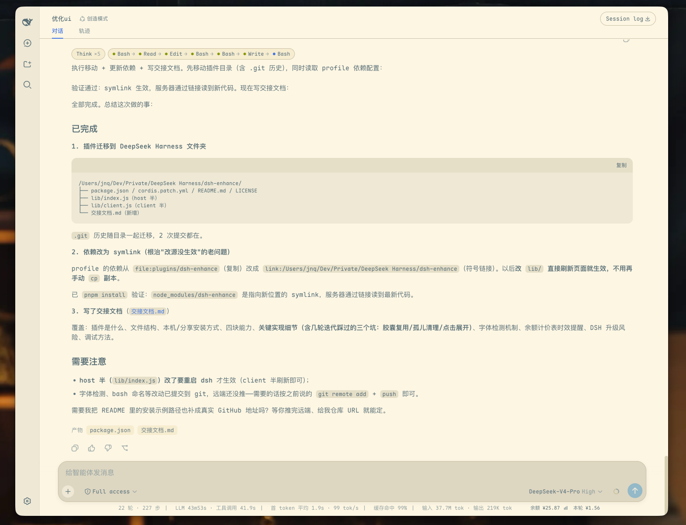

# dsh-ux（本地修改版）

DSH(DeepSeek Harness)Web 界面体验套件,包含两件东西:

| 部分 | 内容 |
|------|------|
| **dsh-enhance**(仓库根目录) | DSH web 插件:紧凑布局 + 账户用量 |
| **dsh-desktop**(`desktop/` 子目录) | 无边框 Electron 桌面壳,双击即用 |

> ⚠️ **本目录是本地修改版**,相对上游 [`jiangnanquan/dsh-ux`](https://github.com/jiangnanquan/dsh-ux) 删除了「主题」「折叠胶囊」「字体」三类功能(见文末[与上游的差异](#与上游的差异本地删减))。
> **不要再从上游更新**(`dsh plugin update dsh-enhance`),否则删减会被覆盖。



> 图为上游原版截图,折叠胶囊与 Solarized 配色**在本修改版中已不存在**。

## 能力(dsh-enhance)

| 类别 | 内容 |
|------|------|
| 紧凑布局 | 会话内容宽度 `94%`、`[data-chat-flow]` 间距 `8px`、输入区改为 flex 单行(`wrap`),压缩纵向占用 |
| 账户余额 | 底部 dock 显示官方账户余额,5 分钟自动刷新,点击跳官方页面 |
| 本轮成本 | 底部 dock 显示本会话累计成本(随会话更新),点击弹出本轮逐次请求图表 |
| 用量图表 | 近 30 天按天堆叠柱状图(缓存读取 / 输入 / 输出 + 成本),数据来自 DSH 本地会话日志 |

## 安装

前置:已按 DSH 的 profile 机制运行(`dsh web`)。

```bash
dsh plugin --profile web add link:/path/to/dsh-ux
```

本包声明了 `dsh.bundle.patch` 与 `dsh.client`,`dsh plugin add` 会自动把它加入 profile 的 bundles,**重启 dsh 后即生效**,无需手改任何配置。重复执行该命令是安全的(幂等)。

升级请用本地检出(改完源码后重启),**不要**用 `dsh plugin --profile web update dsh-enhance`。

## 交给你的 AI

不想手动敲命令?把下面这段话粘贴给任意 AI agent(Claude Code、dsh、Gemini CLI……),让它读本仓库的 INSTALL.md 并完成安装与自检:

> 请按照本仓库 INSTALL.md 里的步骤,在我的机器上安装并验证 dsh-enhance 插件(profile 用 web),然后运行文档里的健康检查并告诉我结果。如果任何一步失败,按文档的回滚步骤恢复原状并说明原因。

## 桌面壳(dsh-desktop)

macOS 无边框沉浸式窗口,把 dsh web 装进桌面应用形态:双击 `启动 DSH.command` 自动拉起后端 + 窗口,退出时只清理自己拉起的后端。支持 `DSH_URL` / `DSH_SNAPSHOT` 环境变量。

见 [desktop/README.md](desktop/README.md)。

## 依赖与前提(dsh-enhance)

- **余额 / 本轮成本 / 用量图表**:调用 DeepSeek 官方接口,需要当前 DSH 已配置 `DEEPSEEK_API_KEY` 凭据;未配置时这些信息显示为查询失败/不可用,不影响其余功能。
- **计价表**:按官方峰谷价(北京时间 9–12、14–18 高峰,其余空闲半价;8/17 前为现行价)硬编码在 `lib/index.js` 的 `pricingFor`,官方调价后需更新。
- 无平台特定依赖:host 端只用 `fetch` + webServer 路由,client 端是纯浏览器 DOM/CSS。

## 与上游的差异(本地删减)

上游 `lib/client.js` 约 39.9 KB,本地为 17.4 KB(少 **415 行**)。删除内容与原因:

| 删除项 | 涉及标识符 | 说明 |
|--------|-----------|------|
| 折叠胶囊 | `stripState`、`FOLDABLE_KINDS`、`buildThinkHtml`、`buildToolsHtml`、`chipHtml`、`createRound`、`createStripInRound` 等全套 CSS + JS | 思考块 `Think ×N` 与工具链 `A → B → C` 胶囊,消息现按官方原样展开 |
| Solarized 主题 | `SOLARIZED_LIGHT`、`DARK_PRESERVE`、`theme.overrideTokens()` | 现使用 DSH 官方默认主题 |
| Maple Mono 字体 | `FONT_CSS`、`mapleMonoAvailable()` | 不再注入任何字体,使用官方字体栈 |
| 橡皮筋滚动 | `overscroll` 相关 CSS(约 7 行) | 2026-08-14 为修滚轮失灵删除,是三项功能删减之外的最小修复 |

**保留**:紧凑布局(`94%` 宽度 + `gap:8px` + composer flex)、余额显示、本轮金额显示、用量统计图表。

## 卸载

```bash
dsh plugin --profile web remove dsh-enhance
```

## License

MIT
